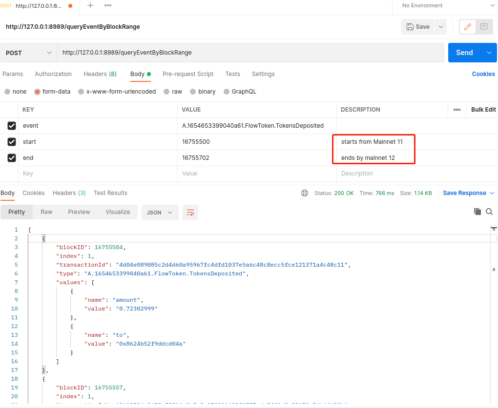

# ultimate-flow-event-fetcher

## Objectives 🐯
Flow is continuously adding new features and discovering and fixing bugs in the Flow node software. They also utilize a Spork as an opportunity to update the nodes with the latest releases.

However, as a DApp developer, though, it makes collecting events from the chain with an arbitrary block range somewhat inconvenient.

To make life easier, we provide the **SporkStore** go module, which can internally handle spork endpoints as well as block range splitting.

## Features 🐮

- [x] Fetch arbitrary events from arbitrary block ranges (max 2000 blocks)

     Example: [Use SporkStore module in go](./example/main.go)

- [x] An wrapped REST API service that can be quickly launched using Docker.
    
- [ ] Query transactions

## Usage 👀

### Go Module

```go
import (
	"fmt"

	"github.com/Lucklyric/ultimate-flow-event-fetcher/spork"
)

func main() {
    // json format of latest spork information
	sporkJsonUrl := "https://raw.githubusercontent.com/Lucklyric/flow-spork-info/main/spork.json"
	sporkStore := spork.New(sporkJsonUrl)
	fmt.Println("sporkJsonUrl:", sporkJsonUrl)

	event := "A.1654653399040a61.FlowToken.TokensDeposited"


    // store will automatically fetch events
    // {19050753 19051853 access.mainnet.nodes.onflow.org:9000}
    // with batchSize 200 blocks
	ret, err := sporkStore.QueryEventByBlockRange(event, 13405050, 13405100)
	if err != nil {
		panic(err)
	}
	jsonRet := spork.BlockEventsToJSON(ret)
	fmt.Println(jsonRet)
	fmt.Println("Total fetched events:", len(jsonRet))

    // store will automatically fetch events with
    // {19049753 19050753 access-001.mainnet13.nodes.onflow.org:9000}
    // {19050753 19051484 access.mainnet.nodes.onflow.org:9000}
	ret, err = sporkStore.QueryEventByBlockRange(event, 19049753, 19051484)
	if err != nil {
		panic(err)
	}
	jsonRet = spork.BlockEventsToJSON(ret)
	fmt.Println(jsonRet)
	fmt.Println("Total fetched events:", len(jsonRet))

    // store will automatically fetch events with
    // {11905073 19051853 access.mainnet.nodes.onflow.org:9000}
	ret, err = sporkStore.QueryEventByBlockRange(event, 19050753, 19051853)
	if err != nil {
		panic(err)
	}
	jsonRet = spork.BlockEventsToJSON(ret)
	fmt.Println(jsonRet)
	fmt.Println("Total fetched events:", len(jsonRet))
}

```

### REST API Service

```shell
docker build . -t onflow-fetcher-service
```

```bash
docker run -d \
    -p 8989:8989
    -e GIN_MODE=release \
    -e SPORK_JSON_URL=https://raw.githubusercontent.com/Lucklyric/flow-spork-info/main/spork.json \
    -e PORT=8989 \
    onflow-fetcher-service
```

or simply use docker compose

```
docker-compose up --build
```

## Contribution
Welcome to contribute 💌

<p align="left">
  
</p>
ChainIDE 🎆 MatrixLab
