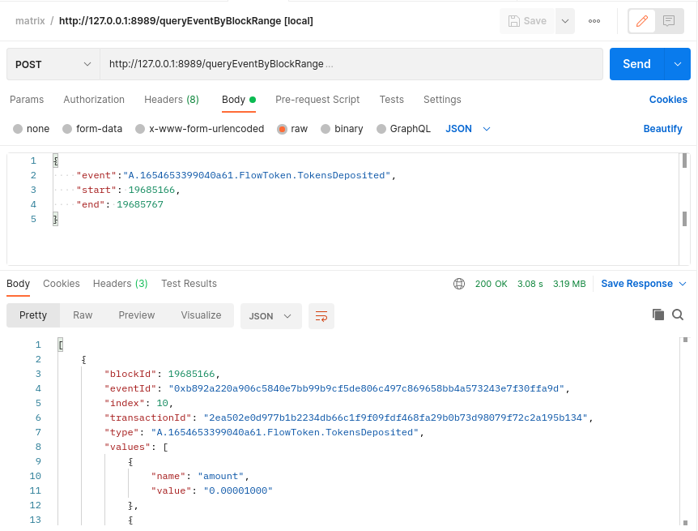
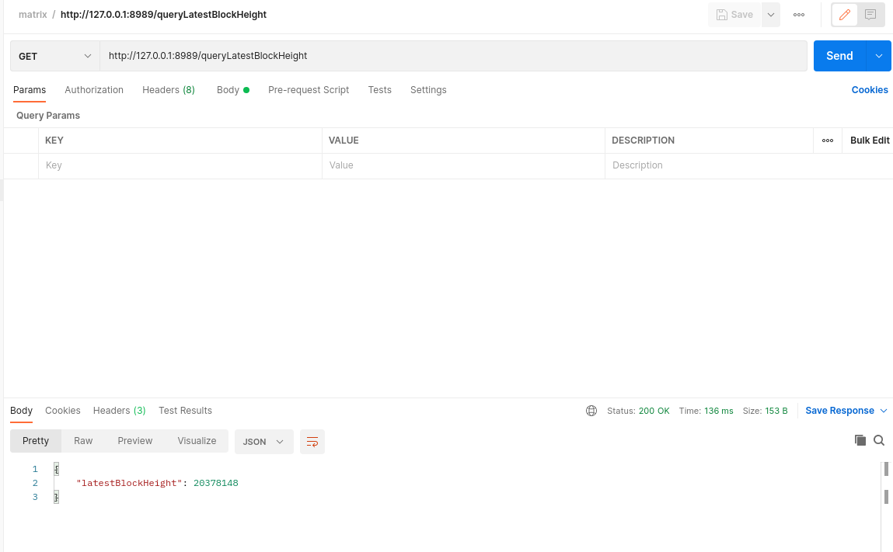
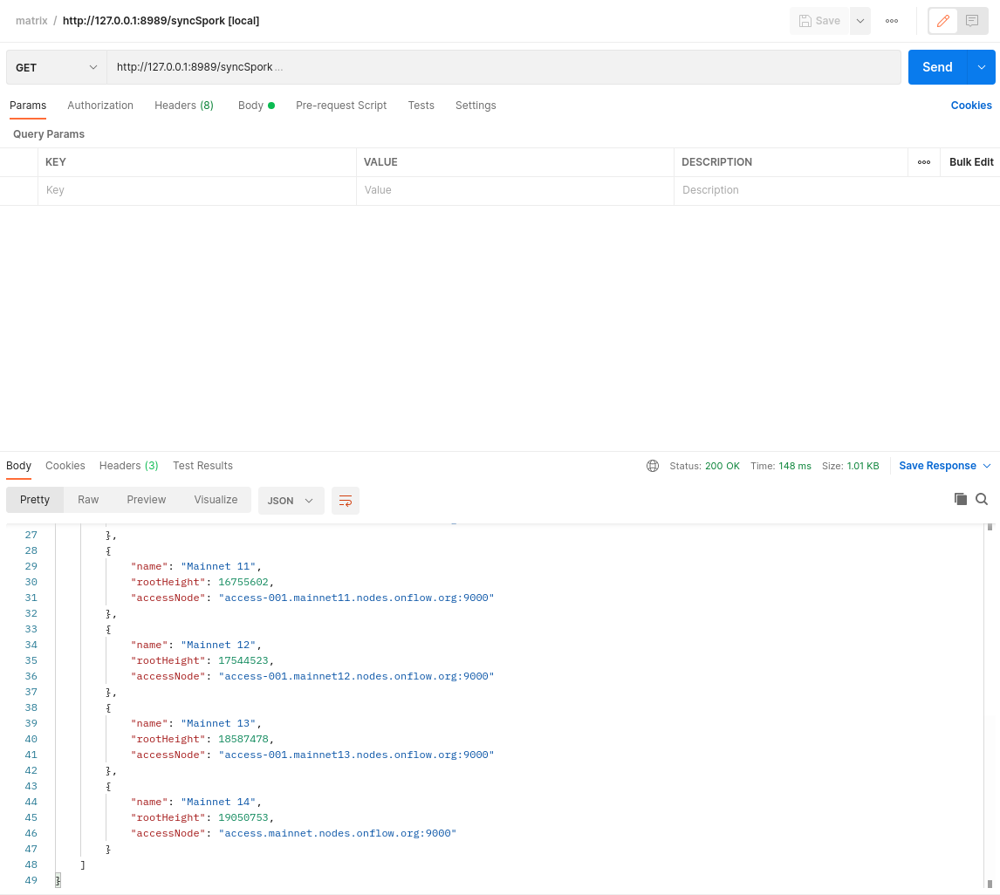

# ultimate-flow-event-fetcher

## Objectives 🐯
Flow is continuously adding new features and discovering and fixing bugs in the Flow node software. They also utilize a Spork as an opportunity to update the nodes with the latest releases.

However, as a DApp developer, it makes it somewhat inconvenient to collect events from the chain with an arbitrary block range.

To make life easier, we provide the **SporkStore** go module, which can internally handle spork endpoints as well as block range splitting.

Additionally, we wrap it in a rest service that can be easily deployed as a microservice via docker or docker-compose and integrated into your current flow project.

## Features 🐮

- [x] Fetch arbitrary events from arbitrary block ranges

     Example: [Use SporkStore module in go](./example/main.go)

- [x] Wrapped REST API service that can be quickly launched using Docker.
    

- [x] Query latest block height
    
- [x] Sync in-memory spork list
    
- [ ] Query transactions

## Structure

## Usage 👀

### Go Module

```go
package main

import (
    "fmt"

    "github.com/MatrixLabsTech/flow-event-fetcher/spork"
)

func main() {
    sporkJsonUrl := "https://raw.githubusercontent.com/MatrixLabsTech/flow-spork-info/main/spork.json"
    maxQueryCount := 2000
    batchSize := 5
    sporkStore := spork.New(sporkJsonUrl, uint64(maxQueryCount), uint64(batchSize))

    event := "A.1654653399040a61.FlowToken.TokensDeposited"

    // store will automatically fetch events
    // {19050753 19051853 access.mainnet.nodes.onflow.org:9000}
    ret, err := sporkStore.QueryEventByBlockRange(event, 13405050, 13405100)
    if err != nil {
        panic(err)
    }
    fmt.Println("Total fetched blocks:", len(ret))
    jsonRet := spork.BlockEventsToJSON(ret)
    fmt.Println("Total fetched events:", len(jsonRet))
    fmt.Println("First Block's blockId:", jsonRet[0]["blockId"])

    ret, err = sporkStore.QueryEventByBlockRange(event, 13405050, 13406060)
    if err != nil {
        panic(err)
    }
    fmt.Println("Total fetched blocks:", len(ret))
    jsonRet = spork.BlockEventsToJSON(ret)
    fmt.Println("Total fetched events:", len(jsonRet))
    fmt.Println("First Block's blockId:", jsonRet[0]["blockId"])

    // store will automatically fetch events with
    // {11905073 19051853 access.mainnet.nodes.onflow.org:9000}
    ret, err = sporkStore.QueryEventByBlockRange(event, 19050753, 19051853)
    if err != nil {
        panic(err)
    }
    jsonRet = spork.BlockEventsToJSON(ret)
    fmt.Println("Total fetched events:", len(jsonRet))
    fmt.Println("First Block's blockId:", jsonRet[0]["blockId"])
}
```

### REST API Service

```shell
docker build . -t onflow-fetcher-service
```

```bash
# mainnet
docker run -d \
    --rm \
    -p 8989:8989 \
    -e GIN_MODE=release \
    -e SPORK_JSON_URL=https://raw.githubusercontent.com/MatrixLabsTech/flow-spork-info/main/spork.json \
    -e PORT=8989 \
    onflow-fetcher-service

# testnet
docker run -d \
    --rm \
    -p 8989:8989 \
    -e GIN_MODE=release \
    -e SPORK_JSON_URL=https://raw.githubusercontent.com/MatrixLabsTech/flow-spork-info/main/spork.testnet.json \
    -e PORT=8989 \
    onflow-fetcher-service
```

🎶 Spork information can be given as a json-formatted resource's URI. We're keeping it in the repo: https://github.com/MatrixLabsTech/flow-spork-info

or simply use docker compose

```bash
# mainnet
docker-compose up --build

# testnet
docker-compose -f docker-compose-testnet.yaml up --build
```

## Contribution
Welcome to contribute 💌

<p align="left">
  
</p>
MatrixLabs 🎆 ChainIDE
